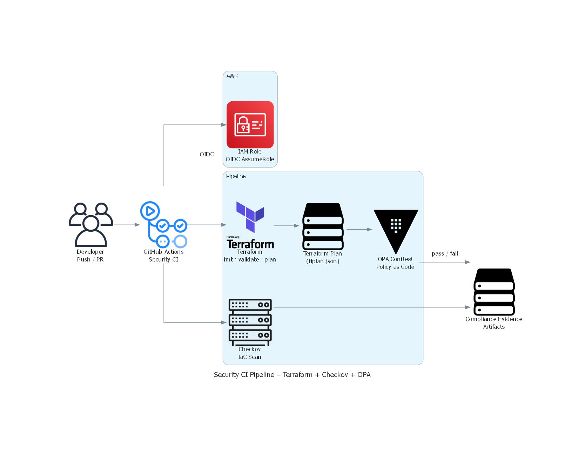

# Autonomous AWS Security & Compliance Enforcement Platform
## CIS AWS Foundations Benchmark

### Overview

This diagram illustrates the end-to-end CI security enforcement flow, from code commit to policy evaluation and compliance evidence generation.

## CI Security Pipeline Architecture and Enforcement Flow

This project demonstrates autonomous prevention, detection, and enforcement of AWS and Kubernetes security controls using Infrastructure as Code, Policy as Code, and runtime admission control.

### Core Technologies
- AWS, EKS
- Terraform
- GitHub Actions
- Open Policy Agent
- OPA Gatekeeper

### CI Pipeline Execution (Successful Run)

The following screenshot shows a successful execution of the security CI pipeline, including authentication, scanning, policy enforcement, and artifact generation.

## High-Level Architecture

This platform is deployed into a single AWS account and is designed using private-by-default networking, strict IAM separation, and centralized logging.

### Core Components
- Amazon VPC with isolated private subnets
- Amazon EKS cluster deployed into private subnets
- IAM roles with least-privilege access per component
- Centralized logging via CloudWatch and CloudTrail
- CI/CD executed externally via GitHub Actions using OIDC

### Trust Boundaries
- GitHub Actions to AWS via OIDC
- Kubernetes control plane to worker nodes
- Admission control boundary enforced by OPA Gatekeeper

**OIDC-Based Authentication Evidence**

The CI pipeline authenticates to AWS using short-lived credentials via OpenID Connect. The following screenshot confirms successful role assumption without static secrets.

### Trust Boundaries and Security Zones

This platform enforces explicit trust boundaries to minimize blast radius and prevent lateral movement.

1. External CI/CD Boundary  
   GitHub Actions interacts with AWS exclusively through OIDC-based IAM role assumption. No static credentials are used.

2. AWS Control Plane Boundary  
   AWS-managed services such as EKS control plane, IAM, CloudTrail, and CloudWatch operate within AWS trust boundaries.

3. Kubernetes Admission Boundary  
   OPA Gatekeeper enforces policy decisions before workloads are admitted into the cluster.

4. Runtime Workload Boundary  
   Kubernetes workloads run in isolated namespaces with restricted privileges and resource constraints.

### Identified Attack Surfaces

- CI/CD pipeline misuse or token abuse
- Misconfigured IAM roles or overly permissive policies
- Public network exposure of Kubernetes services
- Privileged containers or host-level access
- Unvalidated infrastructure changes via Terraform

### Key Data Flows

1. Developer pushes code to GitHub  
2. GitHub Actions validates and scans Terraform code  
3. OIDC-authenticated workflow assumes AWS IAM role  
4. Terraform provisions AWS infrastructure  
5. Kubernetes admission requests evaluated by Gatekeeper  
6. Logs and audit data sent to CloudWatch and CloudTrail

### Network Security Design Decisions

- All workloads are deployed into private subnets
- No public IPs assigned to worker nodes
- Internet access, if required, will be egress-only via NAT
- No inbound access allowed by default

This reduces exposure and enforces private-by-default networking.

### IAM and Identity Design Decisions

- Separate IAM roles for Terraform provisioning, EKS control plane, and worker nodes
- GitHub Actions authenticates using OIDC, not static credentials
- Policies scoped to minimum required actions and resources
- No wildcard permissions in production paths

### Logging and Audit Design Decisions

- CloudTrail enabled for all regions
- Centralized logging to CloudWatch
- Terraform execution logs preserved via CI/CD
- Policy evaluation results stored as evidence

## Security CI Pipeline

### Infrastructure as Code Security Scanning

Terraform configurations are scanned using Checkov to detect misconfigurations and enforce AWS security best practices before deployment.

This repository includes a security-first CI pipeline that:
- Runs Terraform fmt, validate, and plan
- Scans IaC using Checkov
- Evaluates Terraform plans using OPA Conftest
- Enforces least-privilege IAM and VPC controls
- Produces compliance evidence artifacts

### Compliance Evidence and Audit Artifacts

Each pipeline run produces immutable evidence artifacts, including Terraform plans, JSON outputs, and security scan results. These artifacts enable audit readiness and traceability.

## Key Security Design Decisions

- OIDC used instead of static AWS credentials
- Terraform plans evaluated before apply
- Policy-as-Code enforced with OPA (Rego)
- Evidence artifacts generated for audits
- CI fails fast on security violations

## Security and Disclosure Notice

This repository is a sanitized demonstration of a security and compliance enforcement platform.

- No production credentials are included
- AWS account identifiers are redacted
- Terraform state and plan files are excluded
- OIDC configuration values are environment-specific

This project is intended for educational and demonstration purposes.

> NOTE: OIDC thumbprint value is environment-specific and intentionally omitted from this repository.
